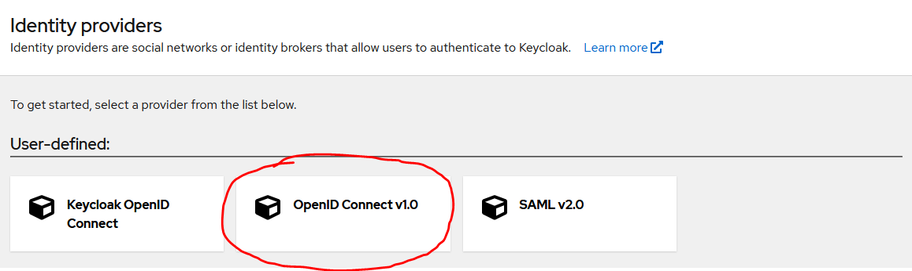
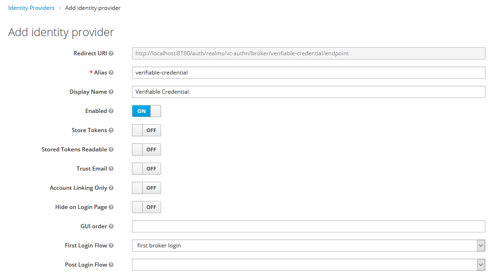
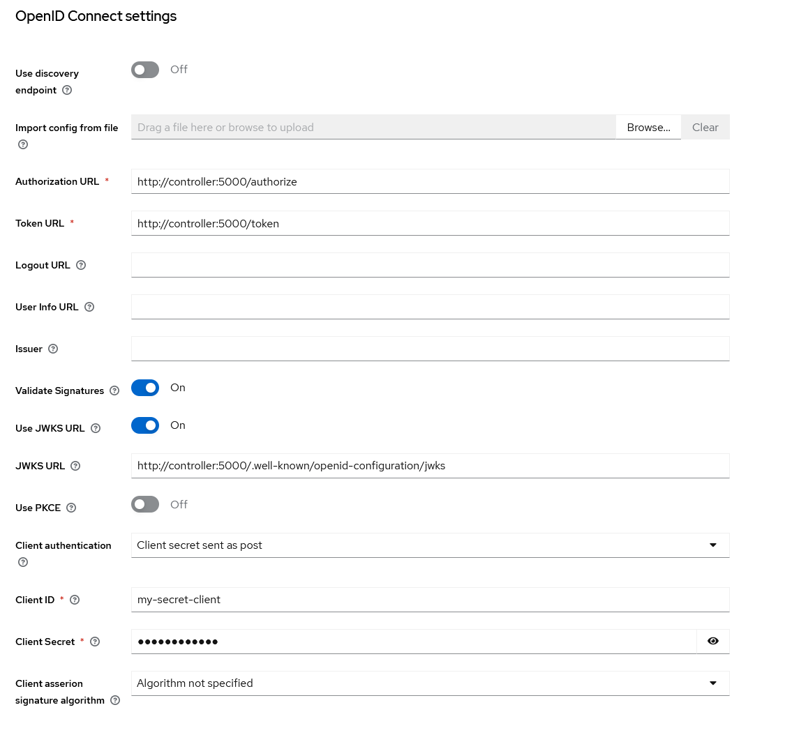

# Configuration Guide

## Using an Access and Identity Management Broker

### Adding VC Authn as Identity Provider

The first step is to add VC Authn as a new Identity Provider for our AIM system. The following instructions are built for Keycloak, but should be applicable for any AIM that supports Open ID Connect.

1. Click on the **Identity Providers** tab, click on the **Add Provider** dropdown and select **Open ID Connect v1.0**.

2. In the next page, select an alias and a display name for your Idp. The alias will be used to generate a unique URL corresponding to the new provider, while the display name will be used in the Keycloak login screen on the button corresponding to the IdP.

3. We will now configure the Open Id Connect parameters for our new provider:

- **Authorization URL**: this must be set to `{PUBLIC_VC_AUTHN_URL}/vc/connect/authorize`

- **Token URL**: this must be set to `{PUBLIC_VC_AUTHN_URL}/vc/connect/token`

- **DIsable User Info**: it is recommended to disable the user info endpoint, since VC Authn does not store/provide user information.

- **Client ID/Client Secret**: these settings will be used to identify and secure the IdP integration between Keycloak and VC Authn. Make sure the **client secret** parameter is unique to your VC Authn instance.

- **Default Scopes**: this must be set to `vc_authn` to instruct the AIM broker which scopes to request from the IdP.

- **Forwarded Query Parameters**: set this to `pres_req_conf_id`. This parameter is used by VC Authn to lookup in its database the configuration to generate presentation request to be displayed to the user and the AIM system needs to forward it when initiating the authentication.

Save the settings and take note of the generated **Redirect URI** and **Client ID/Secret** parameters, they will be usd in the next steps.

### Configuring VC Authn

To configure VC Authn you will need access to its database, either through a terminal or a GUI (the latter is recommended).

The following steps are applicable whether your client is an AIM broker or a web  trying to authenticate directly.

There are several tables that need to be updated when configuring a new client, the following is a list of commonly used settings:

- **Clients**: this table holds the main list of clients that are authorized to authenticate using VC Authn. Add your client, making sure to use your unique **Client ID** name when doing so:

|Id|Enabled|ClientId|ProtocolType|RequireClientSecret|ClientName|Description|ClientUri|LogoUri|RequireConsent|AllowRememberConsent|AlwaysIncludeUserClaimsInIdToken|RequirePkce|AllowPlainTextPkce|AllowAccessTokensViaBrowser|FrontChannelLogoutUri|FrontChannelLogoutSessionRequired|BackChannelLogoutUri|BackChannelLogoutSessionRequired|AllowOfflineAccess|IdentityTokenLifetime|AccessTokenLifetime|AuthorizationCodeLifetime|ConsentLifetime|AbsoluteRefreshTokenLifetime|SlidingRefreshTokenLifetime|RefreshTokenUsage|UpdateAccessTokenClaimsOnRefresh|RefreshTokenExpiration|AccessTokenType|EnableLocalLogin|IncludeJwtId|AlwaysSendClientClaims|ClientClaimsPrefix|PairWiseSubjectSalt|Created|Updated|LastAccessed|UserSsoLifetime|UserCodeType|DeviceCodeLifetime|NonEditable|
|--|-------|--------|------------|-------------------|----------|-----------|---------|-------|--------------|--------------------|--------------------------------|-----------|------------------|---------------------------|---------------------|---------------------------------|--------------------|--------------------------------|------------------|---------------------|-------------------|-------------------------|---------------|----------------------------|---------------------------|-----------------|--------------------------------|----------------------|---------------|----------------|------------|----------------------|------------------|-------------------|-------|-------|------------|---------------|------------|------------------|-----------|
|1|true|unique-id-123456|oidc|false|My Client 12345||||false|true|false|false|false|false||true||true|false|300|3600|300||2592000|1296000|1|false|1|0|true|false|false|client_||2020-05-19 19:11:14|||||300|false|

- **ClientSecrets**: a client secret is not currently used/required, however if one was to be used it would be set in this table.

- **ClientScopes**: each client will need entries for the `openid`, `profile` and `vc_authn` scopes.

- **ClientRedirectUris**: this is the URL that VC Authn will consider as valid redirect target on successful authentication, it will depend on the client implementation. In the case of Keycloak, this must be set to the value  of **Redirect URI** obtained when configuring the Identity Provider.

- **ClientGrantTypes**: each client will need entries for the `implicit` and `code` grant types.

- **ClientCorsOrigins**: when authenticating directly from a web application, the base URL from where the authentication requests will be coming from also need to be configured (e.g.: https://my-webapp.test.com).

## Direct Configuration

VC Authn can also be used directly as Identity Provider, without having to go through an AIM broker system.

To do this, the client application will need to:

- Be appropriately configured in VC Authn (see the [above section](#configuring-vc-authn)).

  - The appropriate redirect URI should be added for the configured client in the  `ClientCorsOrigins` table.

- Target the OIDC endpoints in VC Authn directly (this step will vary slightly depending on the plugin used to implement OIDC, please refer to the documentation for your specific case).

 :warning: When using VC Authn as Identity Provider directly, only the authentication features of OpenID Connect will be available: VC Authn is providing authentication based on the claims presented by the end-user, it is not providing authentication capabilities (this would have to be managed at the application level).
