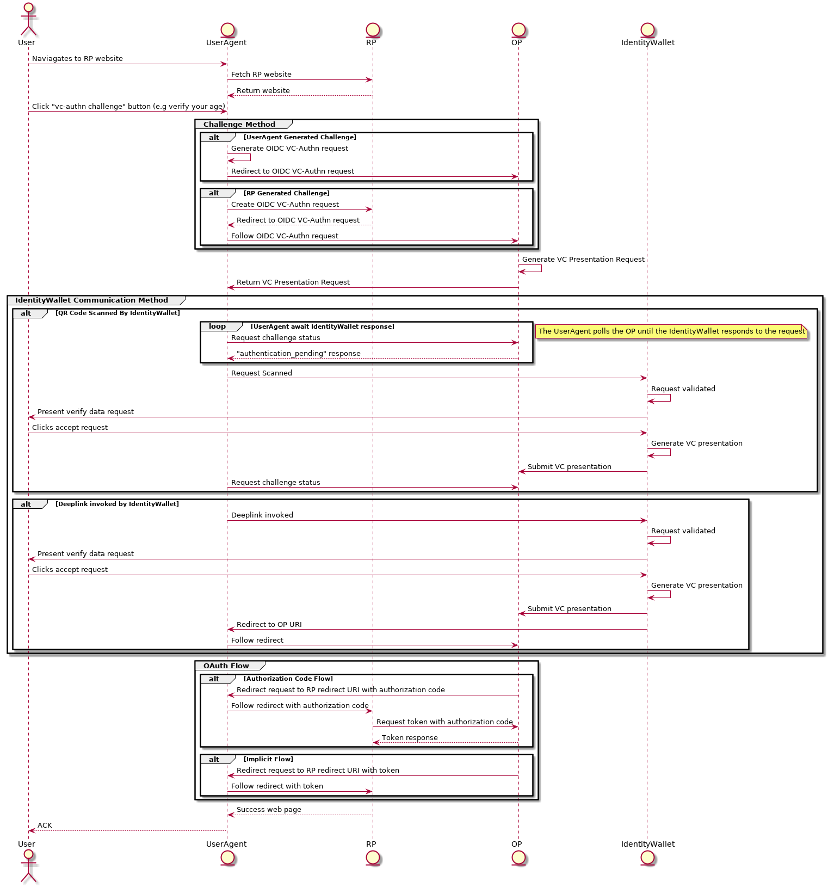

# Verifiable Credential Authentication via OpenID Connect

The following document outlines verifiable credential authentication via [OpenID Connect](https://openid.net/specs/openid-connect-core-1_0.html).

The aim of this document is to describe how a standard OpenID provider (OP) can be extended to support verifiable credential authentication. With this support, a relying party (RP) is able to request this method of authentication to harness the power of verifiable credentials.

## Background

Verifiable credentials are a pending [W3C standard](https://www.w3.org/TR/verifiable-claims-data-model/) that defines a data model for expressing credentials in a verifiable way digitally.

A verifiable credential ecosystem, breaks down in the following way


> Note - the above diagram originated from the Verifiable Credential [specification](https://w3c.github.io/vc-data-model/)

A verifiable credential is essentially a set of one or more claims that is made by an issuer about a subject/holder that when presented to a verifier, its authorship and in most cases ownership can be proven.

The integration this document defines is how holders of verifiable credentials can leverage these to authenticate with parties. Note, how the holder became in possession of supported verifiable credentials is out of scope for this integration.

Like any new technology there is adoption required of new concepts, this particular integration aims to provide an easy integration path that allows parties to start leveraging the power of verifiable credentials for user authentication in a non-disruptive fashion. This is achieved by extending the vastly popular [OpenID Connect](https://openid.net/specs/openid-connect-core-1_0.html) family of specifications.

In reference to the above diagram. A supporting OP will act as the verifier on behalf of a RP for a verifiable credentials presentation. This mode of integration means RP's that already support OIDC only have to extend their support to making VC-AuthN based OIDC requests to a supported OP, rather than adding full support for verifiable credential interactions directly. The holder will use an IdentityWallet (IW) mobile app to store their verifiable credentials and manage presentation requests from verifiers. 

## Abbreviations

Below are some abbreviations that are used throughout this document.

Term                    | Definition
----------------------- |--------------------------
VC                      | Verifiable Credential
VC-AuthN                | Verifiable Credential Authentication
OIDC                    | OpenID Connect
OP                      | OpenID Provider
UserAgent               | Software acting on behalf of the user, in this example usually the web browser
IdentityWallet          | The wallet application that contains the users verifiable credentials (Maps to the Holder/Subject role in reference to the [W3C standard](https://www.w3.org/TR/verifiable-claims-data-model/))
RP                      | The relying party requesting authentication from an OP
VC-AuthN Request        | A request made by a RP to a OP requesting verifiable credential authentication
VC-AuthN Response       | A request made by a RP to a OP requesting verifiable credential authentication
VC Presentation Request | A request made by an OP to an IdentityWallet requesting a verifiable credential presentation
VC Presentation Response| A response made by an IdentityWallet presenting the credentials requested back to a OP
ID Token                | An OIDC identity token emitted by an OP on successful authentication
IAM                     | Identity and Access Management
DIDComm                 | An emerging messaging protocol based on DID infrastructure, see [here](https://github.com/hyperledger/aries-rfcs/tree/master/concepts/0005-didcomm) for more details
IW                      | IdentityWallet
VC-PR                   | Verifiable Credential Presentation Request
VC-P                    | Verifiable Credential Presentation

## Component Diagram

Below depicts a high level component diagram this integration features

```
+--------+                                   +--------+
|        |                                   |        |
|        |------(1) VC-AuthN Request-------->|        |
|        |                                   |        |
|        |  +--------+                       |        |
|        |  |        |<--(2) DIDComm VC-PR---|        |
|   RP   |  |  IW/   |                       |   OP/  |
|        |  | Holder |                       |Verifier|
|        |  |        |---(3) DIDComm VC-P -->|        |
|        |  +--------+                       |        |
|        |                                   |        |
|        |<-----(4) VC-AuthN Response--------|        |
|        |                                   |        |
+--------+                                   +--------+
```

Note - The above diagram has been modified from [this](https://openid.net/specs/openid-connect-core-1_0.html#Overview) diagram from the OpenID Connect specification.

As the above diagram indicates, DID Communication (DIDComm) is used as the messaging protocol between the OP and IW. DIDComm, is an emerging messaging protocol that is being incubated and developed under the [Hyperledger Aries Project](https://www.hyperledger.org/projects/aries) with much of the current protocol documentation residing under the [Aries RFC repository](https://github.com/hyperledger/aries-rfcs). This messaging protocol is used as the medium for the OP to communicate with the IdentityWallet.

## Integration Sequence Diagram

Below is the general sequence diagram that describes the flow.



There are two main ways the interactions between the actors of VC-AuthN will be used

1. The UserAgent and IdentityWallet are co-located on the same device i.e a user is in a browser session (the user agent) and clicks a link that is a deep link which invokes the IdentityWallet (another app on the users phone). After responding to the request the phone is redirected back to the UserAgent.
2. The UserAgent and IdentityWallet are not co-located, i.e the user is browsing on a desktop computer, presentation request is rendered in browser via a QR code. The IdentityWallet scans the QR code and responds to the challenge. The desktop browsing session then updates into the authenticated session.

In the above diagram under the `OAuth Flow` group, both the [Implicit Flow](https://tools.ietf.org/html/rfc6749#section-1.3.2) and [Authorization Flow](https://tools.ietf.org/html/rfc6749#section-1.3.1) defined by OAuth is described for completeness. However, it is widely regarded as industry best practise that Authorization Flow is used in all cases where possible.

## VC-AuthN OP

The below section defines the extensions required to a standard OP, that is required to support VC-AuthN.

### Requirements

A VC-AuthN enabled OP's requirements can be described by the following.

1. Receive and validate VC-AuthN requests (an extended OpenID Connect [authentication request](https://openid.net/specs/openid-connect-core-1_0.html#AuthRequest)).
2. Generate verifiable credential presentation request from the VC-AuthN OIDC request. 
3. Present verifiable credential presentation requests to the user agent in a form consumable by the IdentityWallet (e.g via a QR code or deep-link). 
4. Handle verifiable credential presentations sent from the IdentityWallet back to the OP.
5. Validate verifiable credential presentations
6. Map verifiable credential presentation to OpenID Connect [ID tokens](https://openid.net/specs/openid-connect-core-1_0.html#CodeIDToken).
7. Return the ID token back to the calling RP.
8. Expose an API that allows RPs to manage verifiable credential presentation request configurations.

### OIDC VC-AuthN Request

In order to request an OP to generate a VC-AuthN request, the standard OpenID Connect [authentication request](https://openid.net/specs/openid-connect-core-1_0.html#AuthRequest) sent to the provider must be extended in the following ways.

- In the [scopes](https://openid.net/specs/openid-connect-core-1_0.html#ScopeClaims) requested `vc_authn` must be included
- An additional query parameter of `pres_req_conf_id` must be included where the value is an identifier resolvable by the the OP to a verifiable presentation request configuration outlined [here](####Verifiable_Presentation_Request_Configuration)

**Example request**

```
POST connect/authorize HTTP/1.1
Host: op-server.com
Content-Type: application/x-www-form-urlencoded
client_id=<rp-client-id>
&client_secret=<rp-client-secret>
&scope="openid vc_authn"
&pres_req_conf_id=<pres_req_conf_id>
&response_type=<oauth-response-type>
&redirect_uri=rp.domain.com/redirect
```

Note: `client_id`, `client_secret`, `response_type`, `redirect_uri`, `scope` are all standard parameters defined in the OpendID Connect [authentication request](https://openid.net/specs/openid-connect-core-1_0.html#AuthRequest).

#### VC Presentation Request Configuration

With VC-AuthN the RP instructs the OP on what to authenticate from the end user, the `pres_req_conf_id` parameter present in the request is used to communicate this. The value of this parameter must be resolvable by the OP to an object with the data model defined below.

It is the responsibility of the OP to expose an API that allows a RP to create and manage these request configurations see below for details on the API structure.

##### Data Model

A verifiable credential presentation request configuration, takes the following definition

```
{
    "id" : "<configuration-identifier>"
    "subject_identifier" : "<attribute-referent>"
    "configuration" : {
        "name" : "",
        "version" : "",
        "requested_atrributes" : {
            "attribute_referent" : {
                "name" : "attribute",
                "restrictions" : {
                    {
                        "schema_id": ""
                        "schema_issuer_did": ""
                        "schema_name": ""
                        "schema_version": ""
                        "issuer_did": ""
                        "cred_def_id": ""
                    }
                }
            }
            "attribute_referent" : {
                "name" : "attribute2",
                "restrictions" : {
                    {
                        "schema_id": ""
                        "schema_issuer_did": ""
                        "schema_name": ""
                        "schema_version": ""
                        "issuer_did": ""
                        "cred_def_id": ""
                    }
                }
            }
            //Any number of attribute referents
        }
    }
}
```

//TODO add some more commentary to this sample JSON

See [here](#subject-identifer-mapping) for further details on the purpose of the `subject_identifier` field

### API

In order to manage the different verifiable credential presentation requests an OP can generate, the OP must expose the following endpoints.

`/vcpresentation/configuration` HTTP POST

Request Body : [Data Model](#data-model)
Returns : id

`/vcpresentation/configuration` HTTP GET

Returns : List of [Data Model](#data-model)

`/vcpresentation/configuration/{id}` HTTP GET

Returns : [Data Model](#data-model)

`/vcpresentation/configuration/{id}` HTTP DELETE

Return : 200 Ok
Return : 404 Not Found

### Verifiable Credential Presentation DIDComm Messages

The DIDComm protocol applicable to this integration is the [present proof protocol](https://github.com/hyperledger/aries-rfcs/tree/master/features/0037-present-proof)

The OP when presented with a valid OIDC VC-AuthN request will generate a verifiable credential presentation request from the configuration referenced in the request.

**Example Presentation Request From OP**

```
{
    "@type": "did:sov:BzCbsNYhMrjHiqZDTUASHg;specification/present-proof/1.0/request-presentation",
    "@id": "<uuid-request>",
    "comment": "some comment",
    "~service": {
        "recipientKeys": ["8HH5gYEeNc3z7PYXmd54d4x6qAfCNrqQqEB3nS7Zfu7K"],
        "routingKeys": ["8HH5gYEeNc3z7PYXmd54d4x6qAfCNrqQqEB3nS7Zfu7K"]
        "serviceEndpoint": "https://example.com/endpoint"
    },
    "request_presentations~attach": [
        {
            "@id": "request-presentation-0",
            "mime-type": "application/json",
            "data":  {
                "base64": "<bytes for base64>"
            }
        }
    ]
}
```

Note - The above request should use the [signed envelope](https://github.com/hyperledger/aries-rfcs/tree/master/features/0066-non-repudiable-cryptographic-envelope) format, where by the signer should be the public DID of the OP. This signed envelope should then be formatted to the defined URL format (TBA). 

**Example Presentation From IW**

```
{
    "@type": "did:sov:BzCbsNYhMrjHiqZDTUASHg;specification/present-proof/1.0/presentation",
    "@id": "<uuid-presentation>",
    "comment": "some comment",
    "presentations~attach": [
        {
            "@id": "presentation-0",
            "mime-type": "application/json",
            "data": {
                "base64": "<bytes for base64>"
            }
        },
    ]
}
```

Note - the above response should use the [encryption envelope](https://github.com/hyperledger/aries-rfcs/tree/master/features/0019-encryption-envelope) format, using the `~service` decorator from the request to prepare the encrypted content.

### VC-AuthN Response

An OP, on successful authentication returns an ID token back to the RP's redirect URI. Population of this ID token is done through mapping it from the verifiable credential presentation sent by the IW back to the OP.

//TODO add some commentary on the `access_token` usage

#### Verifiable Presentation -> OP ID Token

The authentication response of an OpenID Connect request features an [ID token](https://openid.net/specs/openid-connect-core-1_0.html#IDToken)

A VC-AuthN OP uses the information disclosed by the identity wallet in a VC Presentation to construct this ID token, the following details the different mappings to the various fields in the Id token.

Below is a list of the fields present in a standard ID token and the considerations that are made in the context of VC-AuthN.

Field                   | Definition                                                                                             | Value
----------------------- |------------------------------------------------------------------------------------------------------- | ------------
iss                     | Issuer Identifier for the OP, must be a valid URL using the HTTPS scheme                               | Same as OIDC specification.
sub                     | Subject Identifier A locally unique and never reassigned identifier within the Issuer for the End-User | See [here](#subject-identifer-mapping)
aud                     | Audience(s) that this ID Token is intended for                                                         | Same as OIDC specification.
exp                     | Expiration time on or after which the ID Token MUST NOT be accepted for processing                     | Same as OIDC specification.
iat                     | Time at which the JWT was issued                                                                       | Same as OIDC specification.
auth_time               | Time when the End-User authentication occurred                                                         | Same as OIDC specification.
nonce                   | String value used to associate a Client session with an ID Token, and to mitigate replay attacks       | Same as OIDC specification.
acr                     | Authentication Context Class Reference                                                                 | Not used
amr                     | Authentication Methods References                                                                      | Value set to vc_authn
azp                     | Authorized party - the party to which the ID Token was issued                                          | Not used

Below details the additional information that will be added in the context of VC-AuthN.

- `pres_req_conf_id` will be present as a claim in the ID token indicating the presentation request the VC-AuthN service presented to the user.

Any attributes that are disclosed in the verifiable presentation sent by the IW back to the RP will also be mapped to claims present in the ID token.

**Example**

Assume in the following example Alice was given a verifiable presentation that asked for her `email` and `firstName` from any verifiable credential. The verifiable presentation configuration was set to use email attribute disclosed as the subject identifier in the ID token mapping. Below shows an example of what the resulting ID token.

```
{
   "iss": "https://vc.op.example.com",
   "sub": "user@example.com",
   "aud": "example_rp",
   "nonce": "n-0S6_WzA2Mj",
   "exp": 1311281970,
   "iat": 1311280970,
   "auth_time": 1311280969,
   "amr": "vc_authn",
   "email" : "user@example.com",
   "firstName" : "Alice"
  }
```

#### Subject Identifer Mapping.

To quote from the OpenID Connect specification on [ID tokens](https://openid.net/specs/openid-connect-core-1_0.html#IDToken), in particular the `sub` property.

`sub : REQUIRED. Subject Identifier. A locally unique and never reassigned identifier within the Issuer for the End-User, which is intended to be consumed by the Client, e.g., 24400320 or AItOawmwtWwcT0k51BayewNvutrJUqsvl6qs7A4. It MUST NOT exceed 255 ASCII characters in length. The sub value is a case sensitive string`

When a OP is performing VC-AuthN, and the request has reached the point where the VC presentation has been generated and sent by the IW to the OP, the OP must now map contents of this VC presentation to a ID token. The question is then raised on what should populate this field. The two options available are:

1. Nominate a disclosed attribute in the verifiable credential presentation that is used to populate the subject field.
2. Ephemeral generate an identifier for this field e.g a randomly generated GUID.

Note - In option 2. this prevents the often desirable property of cross session correlation of an authenticated user, which will effect the ability for many integrating IAM solutions being able to conduct effective auditing.

#### UserInfo Endpoint

//TODO complete this section

## IAM Solution Integration

Because this specification defines extending a valid OP to include VC-AuthN support, integration with many existing IAM solutions can be added without any major additional work.

In reference to the diagram presented in [section](#component-diagram), an IAM system simply assumes the role of a RP to the VC-AuthN compatible OP. Which is identical to how many IAM solutions already federate to other supported OP's. 

## OP Discoverability

IANA defines a set of [well-known URIs](/.well-known/openid-configuration) to improve discoverability on the web.

The OpenID Connect family of specifications defines how this is leveraged in their [discovery specification](https://openid.net/specs/openid-connect-discovery-1_0.html) to allow OP's to expose metadata about themselves.

Note: The mechanism of discovery for the OP via [WebFinger RFC7033](https://tools.ietf.org/html/rfc7033) is not effected via the VC-AuthN extension of OIDC, instead the only effect this integration has is adding additional metadata about the OP, details of this metadata can be found [here](https://openid.net/specs/openid-connect-discovery-1_0.html#ProviderMetadata).

The following metadata must be present at the OP's `/.well-known/openid-configuration` endpoint

- TODO complete this section

## Un-Answered questions

- SIOP instead of DIDComm for the requests between the RP and IW?
- Should the verifiable credential presentation configuration data model be a valid JSON-LD object
- Should the `pres_req_conf_id` instead be a [URN](https://tools.ietf.org/html/rfc8141) so the OP does not necessarily have to host the additional configuration API?
